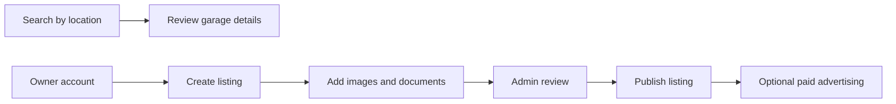

# AutoLane Garage Marketplace

> A location-aware marketplace for discovering, listing, managing, and promoting garage or parking space.

## Overview

AutoLane connects people searching for affordable garage or parking space with owners who can publish, price, and manage listings. The product combines geospatial search, listing creation, document/media uploads, owner management, advertising by postal area, payment flows, and an administrative console.

## My contribution

- Multi-route React application with public search and authenticated owner journeys
- Garage listing creation/editing with validation, image/document upload, pricing, deposits, and policies
- Mapbox-powered location and directions experience
- Firebase authentication and Redux state management
- Stripe-powered advertising/payment flow with success handling
- Admin management for garages, users, advertisements, fees, discounts, and postal areas
- Responsive UI composed from Bootstrap, Material UI, and reusable form patterns

## Skills demonstrated

| Area | Applied |
| --- | --- |
| React | Route-based product areas, protected views, reusable forms, listing details, and owner/admin workflows |
| State management | Redux actions/reducers for auth, garage data, metrics, and application state |
| Mapping | Mapbox geocoding, coordinates, directions, and location-aware discovery |
| Payments | Stripe Elements and payment success/failure handling for paid promotion workflows |
| Authentication | Firebase Auth integration and role-aware admin access |
| Data & files | API integration, image previews, insurance/contracts, and listing media workflows |
| UX | Search, filters, pricing summaries, confirmation states, responsive forms, and feedback dialogs |

## Core flow

## Technical stack

React 18 · React Router · Redux · Firebase Auth · Mapbox SDK · Stripe · Material UI · Bootstrap · Axios · React Hook Form · PDF rendering.

See [architecture](docs/ARCHITECTURE.md), [user flows](docs/USER-FLOWS.md), [security policy](SECURITY.md), [screenshot guide](docs/SCREENSHOT-GUIDE.md), and [GitHub setup](docs/GITHUB-SETUP.md).
"# autolane-garage-marketplace" 
