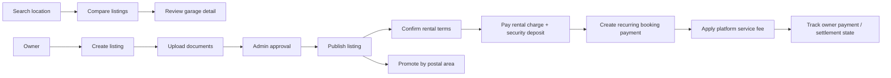

# User flows

## Booking payment and commission flow

- The renter reviews the garage, rental rate, deposit, and payment schedule before checkout.
- Stripe Elements tokenizes the card details; the application sends only the payment method reference to the payment API.
- The payment API creates the recurring subscription for the booking and returns a success or failure state to the contract screen.
- A configurable per-payment service fee represents the platform commission. Administrators can update the fee rule without exposing financial secrets in the client.
- The resulting payment, deposit, subscription, fee, and owner settlement state can be reconciled against the booking/contract record.
